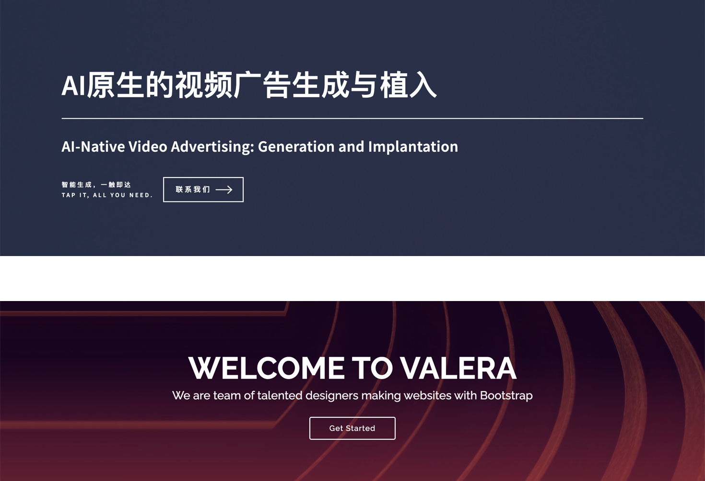
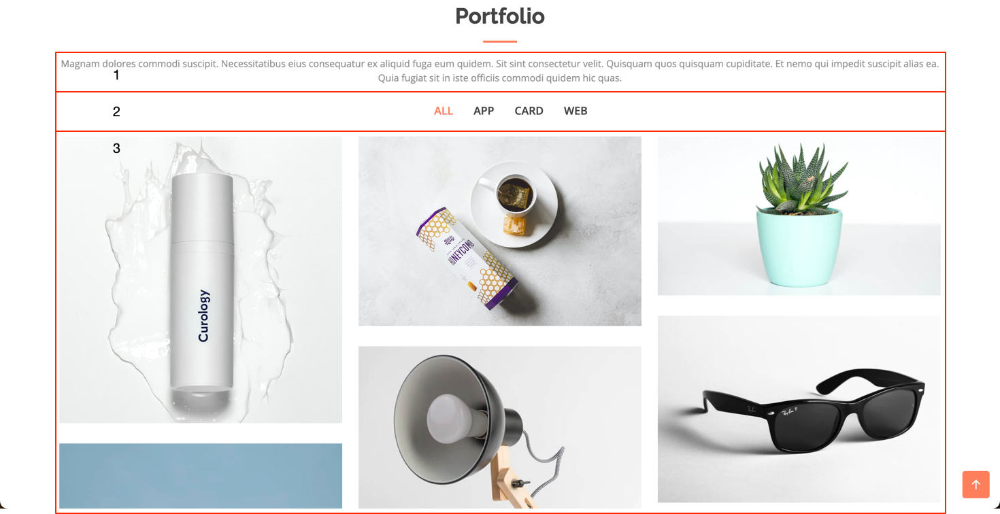
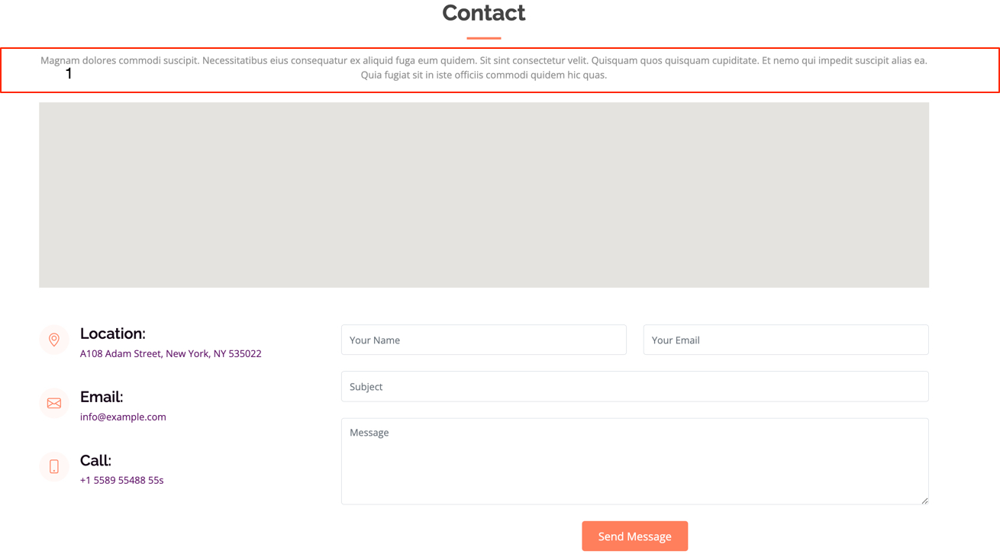

## 官网需求 2024-02-23

在当前页面模板下，保留并优化以下模块

Home, About, Portfolio, Contact（导航栏也只保留这几个模块）

### 1 中英文切换
在导航栏增加一个按键，实现网站内容中英文切换

### 2 Home（首页）
将 tapall.ai 的 Home 内容搬运到模板的 Home，如下图所示：



Get Started，变成：立即尝试（Try it now），链接到平台 www.kuosanyinzi.com

### 3 About（关于）
目前暂时改成纯文字：塔普智能专注于为企业与个人提供AI原生的视频生成与植入服务，致力于构建定制化的AI视频生产线，以满足不同用户的独特需求。通过旗下平台```<a>```扩散因子```</a>```（链接到 ```www.kuosanyinzi.com```），我们为用户提供包括AI视频编辑、AI数字人以及图文转视频等在内的智能产品服务。

### 4 Portfolio（作品集）
如下图，区域 1，先写成：预留区域（Reserved Area)
区域 2，暂时去除 ALL（显示所有图片），只有两个选项：AI视频植入，AI数字人



每个选项，对应一组视频，展示在区域 3，区域 3 的每个模块，显示一个视频（可以重复使用 assets/vid/place-anything 或 assets/vid/meta-human 里面的 mp4 文件做测试使用）后续会持续增加视频在这两个文件夹（目前的素材不一定对应主题，只是为了测试能展示视频）

### 5 Contact（联系我们）
如下图，同样的，区域 1，先写成：预留区域（Reserved Area)



其他部分，对照着改成公司内容就好

Email: service@tapall.ai
Location: 深圳市南山区留仙大道南山智园崇文园区

英文：Nanshan Zhiyuan (Intelligent Park) Chongwen Park, ShenZhen, 518055, China

地图先不要了

电话删掉，换成微信二维码（先用一个正方形图片代替）
