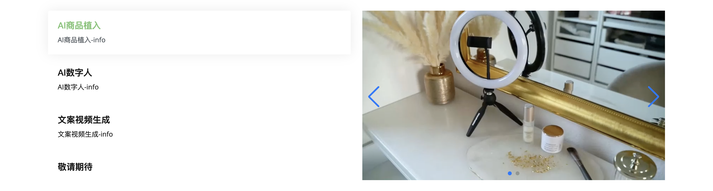

## 官网需求 2024-03-14

### 1.1 左边的 TAPALL，换成 Arial Black 字体

### 1.2 语言切换，放在最右边，和中间区分开

### 1.3 中间的间距也适当宽松一些

### 2.1 左边的文字底色，换成”扩散因子“的黄色

### 2.2 右边箭头和点的底色，也是一样的

### 2.3 敬请期待，可以设置成没反应，不用显示空的

### 3 目前好像所有视频在打开网页都是播放状态，是不是这个也是导致进入慢的原因？是否可以变成，显示哪个播放哪个，不显示就停止播放（默认启动不播放，只有显示在这个窗口上才播放）

### 4 删除联系我们的预留区域

### 5 分别显示：企业用户、个人用户、生成总数、技术支持

Enterprise Users and Individual Users, Generated Videos, Hours of Support

数字先随意吧

